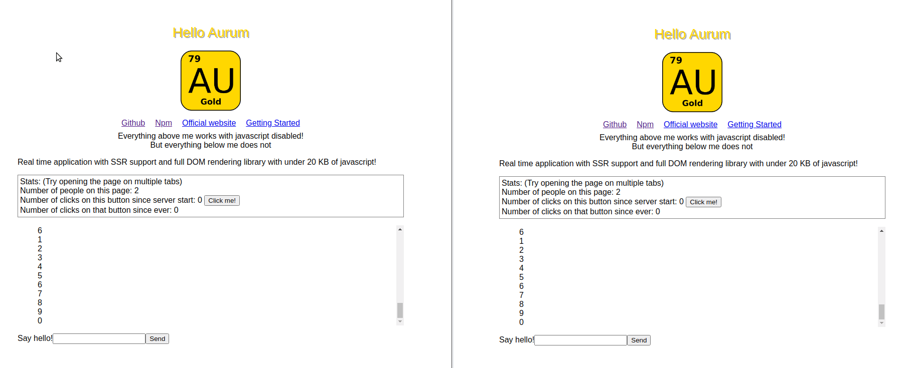

    

Seed project to use Aurum across the full stack with a aurum-db aurum-server and aurum.js with typescript powered by Webpack and jest

This seed project provides all the configuration needed to start working right away on a website using aurum.
All you have to do is npm install to get started.

Npm scripts:

| Script              | Effect                                                   |
| ------------------- | -------------------------------------------------------- |
| npm run build       | Builds the project                                       |
| npm run watchclient | Builds the client side of the project in watch mode      |
| npm run watchserver | Builds the server side side of the project in watch mode |
| npm run test        | Runs all unit tests                                      |
| npm run host        | Hosts the site                                           |

You can customize the webpack config to swap out or change technologies. The CSS Loader supports LESS so you can import LESS or CSS right from your code
This setup supports server side rendering, reactive database, real time stream synchronization between backend and client and front end powered by aurum.js.

This is ideal for real time single page applications

Preview:

    

